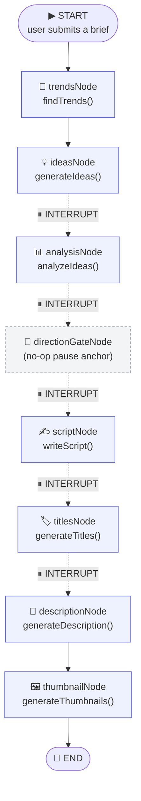
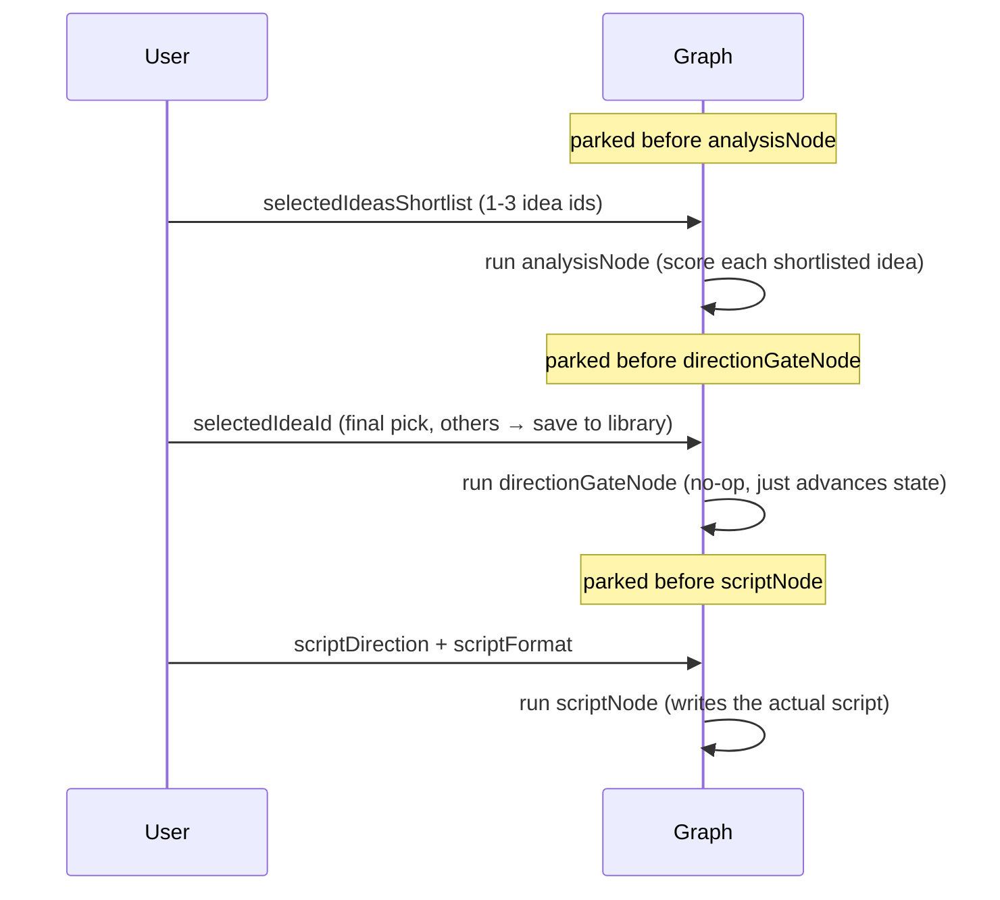
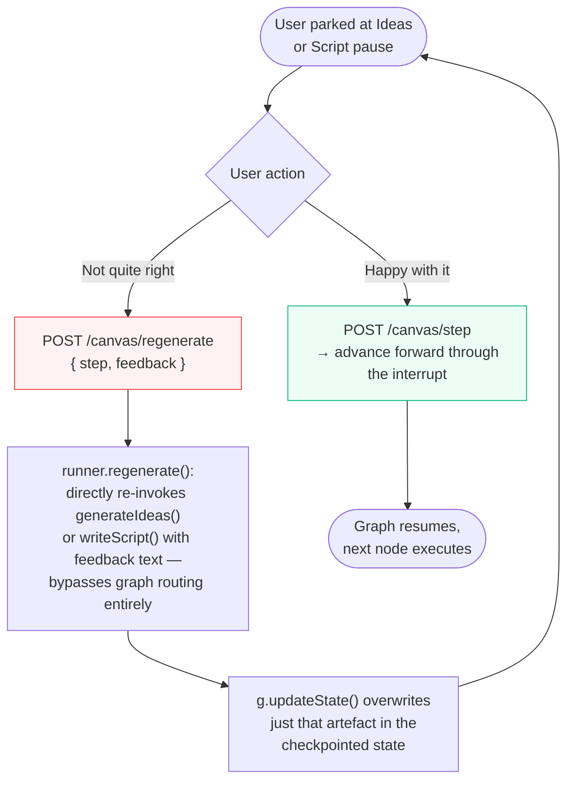
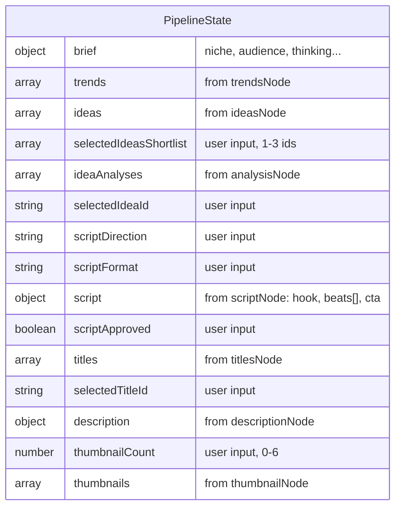
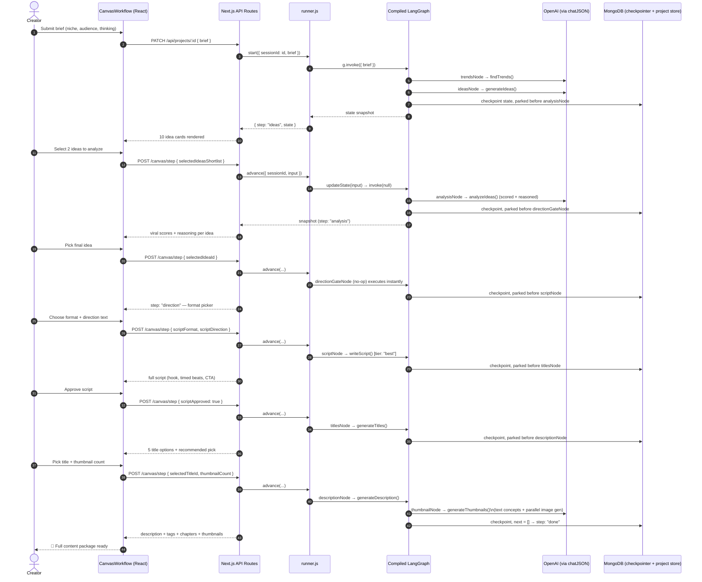
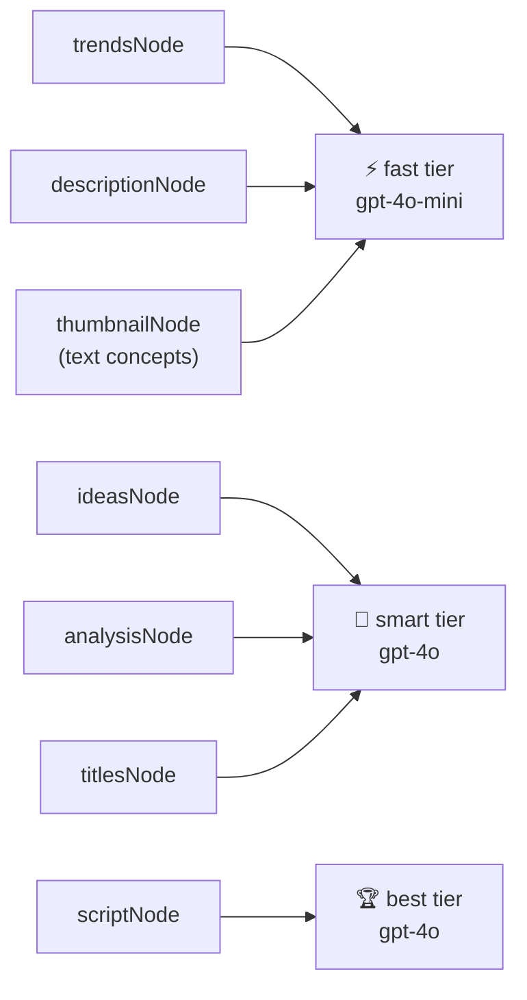
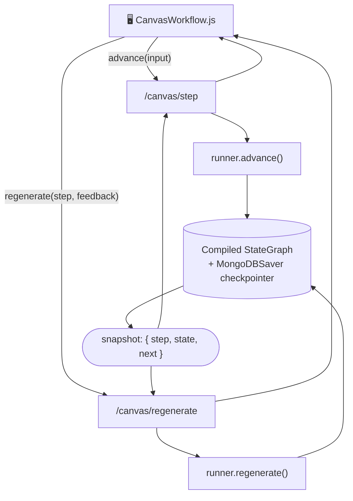
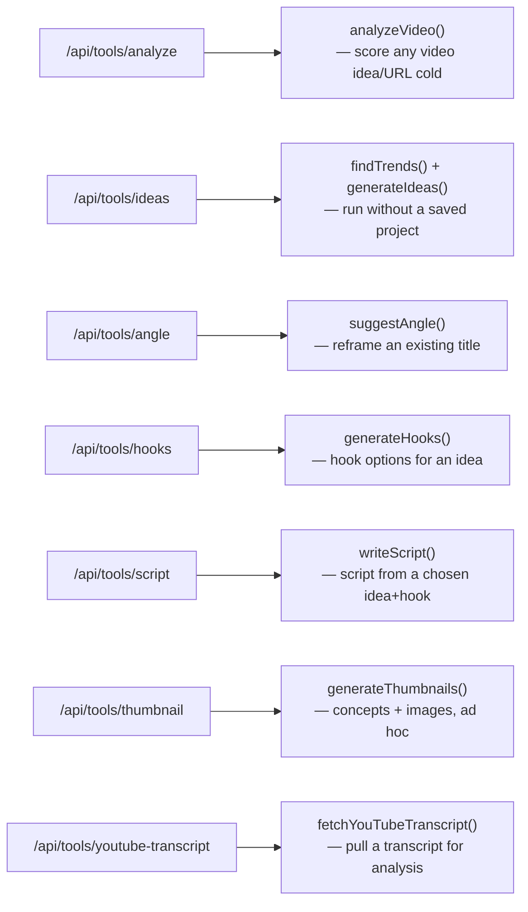
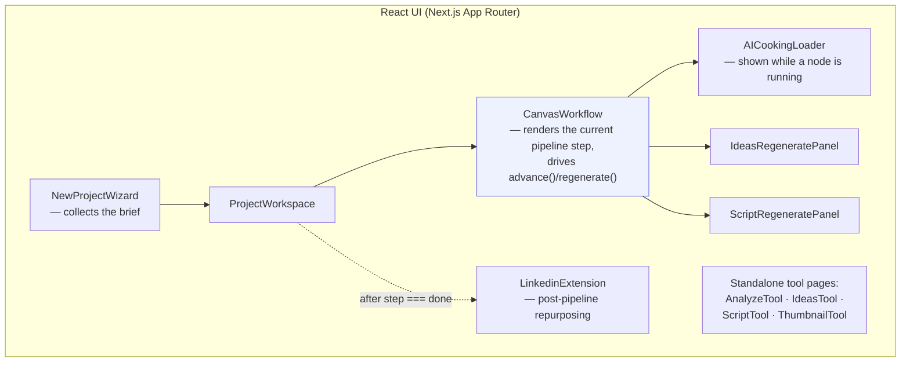

<div align="center">

# 🌀 Fluxa

### An AI content-creation studio, orchestrated by a LangGraph pipeline


**Turn a one-line video brief into trends, ideas, a graded viral analysis, a full script, titles, a description, and thumbnails — with the human in the loop at every real decision point.**

[Purpose](#-purpose) • [The LangGraph Pipeline](#-the-langgraph-pipeline) • [Pause Points & User Decisions](#-pause-points--user-decisions) • [Data Flow](#-data-flow) • [Endpoints](#-endpoints--how-they-talk-to-the-graph) • [Components & Tools](#-components--standalone-tools) • [Strengths](#-strengths)

</div>

---

## 🎯 Purpose

Making a YouTube video well means making a *chain* of decisions — what's trending, which idea has legs, how to script it, what to title it, what thumbnail wins the click. Doing all of that with one giant AI prompt produces generic, unsteerable output because the human never gets to weigh in **between** decisions.

Fluxa's answer is to model the entire creative process as a **LangGraph state machine**: a fixed sequence of AI "nodes," each doing one focused job, with the graph **pausing before the nodes that need a human judgment call** — and resuming exactly where it left off once that input arrives. The graph's state is checkpointed in MongoDB per project, so a creator can close their laptop mid-pipeline and come back days later to the exact same spot.

This README documents that pipeline end-to-end: how it's built, where it pauses, what the user decides at each pause, and how the API/UI layers keep the graph moving.

---

## 🕸️ The LangGraph Pipeline

Fluxa's entire creative pipeline is one compiled `StateGraph` (`src/services/ai/graph/graph.js`) over a shared `PipelineState`. Eight nodes, wired in a strict line — but five of the edges have an `interruptBefore` gate, which is what turns a linear AI script into an interactive product.



Two nodes run automatically back-to-back before the first pause (`trendsNode → ideasNode`), because there's no decision to make yet — the user hasn't seen anything to react to. Every node after that sits behind an `interruptBefore`, so the graph literally cannot proceed until a human calls `advance()` with the input it's waiting for.

### Why `directionGateNode` exists

This is the subtlest, most deliberate piece of the design. The pipeline needs **two different user inputs** between `analysisNode` and `scriptNode` — "which idea did you finally pick?" and "what direction/format should the script take?" — but LangGraph interrupts pause *before* a node, not *between* arbitrary points. `directionGateNode` is a genuine no-op node that exists purely to create a second pause slot:



Because `deriveCurrentStep()` maps "*next node about to run*" to "*screen the user is on*", the mapping intentionally looks off-by-one at first glance — parked-before-`directionGateNode` means the user is looking at the **analysis** screen, and parked-before-`scriptNode` means they're on the **direction** screen. This indirection is what lets one linear graph serve a multi-screen wizard.

---

## ⏸️ Pause Points & User Decisions

This is the heart of "human-in-the-loop": exactly what the graph is asking for at each of its five interrupts, and what happens once it gets an answer.

```mermaid
flowchart LR
    subgraph P1["⏸ Pause 1 — before analysisNode"]
        direction TB
        Q1["Screen: Ideas\n'Pick 1–3 ideas to analyze,\nor regenerate with feedback'"]
        A1["Input: selectedIdeasShortlist\n(array of 1–3 idea ids)"]
    end
    subgraph P2["⏸ Pause 2 — before directionGateNode"]
        direction TB
        Q2["Screen: Analysis\n'Here's a viral-potential score\nfor each shortlisted idea —\npick your final one'"]
        A2["Input: selectedIdeaId\n(single idea id)"]
    end
    subgraph P3["⏸ Pause 3 — before scriptNode"]
        direction TB
        Q3["Screen: Direction\n'Choose a script format and\noptionally add creative direction'"]
        A3["Input: scriptFormat + scriptDirection"]
    end
    subgraph P4["⏸ Pause 4 — before titlesNode"]
        direction TB
        Q4["Screen: Script\n'Approve this script,\nor regenerate with feedback'"]
        A4["Input: scriptApproved: true"]
    end
    subgraph P5["⏸ Pause 5 — before descriptionNode"]
        direction TB
        Q5["Screen: Titles\n'Pick your favorite title,\nchoose how many thumbnails\n(or skip thumbnails entirely)'"]
        A5["Input: selectedTitleId +\nthumbnailCount (0–6)"]
    end

    P1 --> P2 --> P3 --> P4 --> P5

    style P1 fill:#fff7ed,stroke:#f97316
    style P2 fill:#fff7ed,stroke:#f97316
    style P3 fill:#fff7ed,stroke:#f97316
    style P4 fill:#fff7ed,stroke:#f97316
    style P5 fill:#fff7ed,stroke:#f97316
```



Every one of those "Input" shapes is a **Zod-validated union** (`canvasStepInputSchema`) — the API rejects malformed input before it ever touches the graph:

```js
canvasStepInputSchema = z.union([
  z.object({ selectedIdeasShortlist: z.array(z.string()).min(1).max(3) }),
  z.object({ selectedIdeaId: z.string() }),
  z.object({ scriptDirection: z.string().max(800).optional(), scriptFormat: scriptFormatSchema }),
  z.object({ scriptApproved: z.literal(true) }),
  z.object({ selectedTitleId: z.string(), thumbnailCount: z.number().int().min(0).max(6).default(3) }),
]);
```

### The two feedback loops (regenerate without leaving the pause)

At the **Ideas** and **Script** pauses, the user isn't limited to only "approve and move on" — they can also say *"not this, try again, and here's why"* without advancing the graph at all:



This is why `regenerate()` in `runner.js` calls `generateIdeas()` / `writeScript()` **directly** instead of re-running graph edges — the graph's position (which interrupt it's parked at) must not move, only the content sitting in that slot.

---

## 🔄 Data Flow

### 1. Shared pipeline state (`PipelineState`)

Every node reads from and writes to one shared object. Fields are last-write-wins (no merging needed — each step owns its own slot):



### 2. One full pipeline run, request by request



### 3. Model tiering — not every step needs the same brain

`resolveModel()` routes each agent call to a cost/quality tier, so the pipeline doesn't spend GPT-4o-level tokens on tasks that don't need it:

| Tier | Used by | Why |
|---|---|---|
| ⚡ `fast` | trends, description, thumbnail *concepts* | Structured, low-creativity extraction/formatting tasks |
| 🧠 `smart` | ideas, idea analysis, titles | Quality and nuance matter, but not maximal reasoning |
| 🏆 `best` | script | The one artefact the whole video hinges on |



Every model call funnels through one function, `chatJSON()` — the single place the OpenAI SDK is touched — which also enforces the response against a **Zod schema** so a node can never receive malformed AI output, and supports an `AI_MOCK=true` mode that returns realistic fixture data with zero API cost (used by the smoke-test scripts).

---

## 🔌 Endpoints — How They Talk to the Graph

| Method & Path | Talks to | What it does |
|---|---|---|
| `POST /api/projects` | `start()` | Creates a project; if a brief is included, immediately kicks off the graph and returns the first snapshot |
| `PATCH /api/projects/:id` | `start()` | Submits a brief to an existing (not-yet-started) project |
| `GET /api/projects/:id` | `snapshot()` | Reads the current graph state + derived step for page loads/refreshes |
| `POST /api/projects/:id/canvas/step` | `advance()` | The core "answer the current pause and move forward" endpoint — validates input against `canvasStepInputSchema`, updates state, resumes the graph to the next interrupt |
| `POST /api/projects/:id/canvas/regenerate` | `regenerate()` | Re-runs `ideasNode` or `scriptNode`'s underlying agent with feedback text, **without** moving the graph's position |
| `GET/POST /api/projects/:id/extensions/linkedin` | `generateLinkedinPost()` | Post-pipeline extension: turns the finished script into a LinkedIn post, stored on the project, independent of the graph |
| `POST /api/projects/:id/extensions/linkedin/image` | `linkedinImage.agent` | Opt-in image generation for the LinkedIn post (kept separate so it isn't generated — and billed — automatically) |



Every route follows the same shape: `auth()` → load the project (ownership-scoped by `userId`) → `zod.safeParse` the body → call into the graph/runner layer → return `{ project, snapshot }`. This keeps every AI decision behind the same authorization and validation gate, no matter which step of the pipeline it belongs to.

### Standalone tool endpoints (outside the graph)

Not every AI feature needs the multi-step pipeline. Fluxa also exposes each capability as an **independent, single-shot tool endpoint** — used both by the dedicated `/analyze`, `/create/ideas`, `/create/script`, `/create/thumbnail` pages and reusable elsewhere:



These share the exact same agent functions as the graph nodes (`generateIdeas`, `writeScript`, `generateThumbnails`, ...) — the graph is an orchestration layer *on top of* the agents, not a separate implementation of them.

---

## 🧩 Components & Standalone Tools



- **`CanvasWorkflow.js`** is the single component that renders *whatever screen the current pipeline step calls for* — it reads `snapshot.step` and switches between `IdeasStep`, `AnalysisStep`, a direction/format picker, `ScriptStep`, and `TitlesStep`, so the graph's state literally drives the UI's render tree.
- **`AICookingLoader`** shows a distinct loading state per in-flight node — the UI always knows *which* AI call it's waiting on, not just "loading."
- **Regenerate panels** are deliberately separate components so the "keep old content visible while a rewrite streams in" UX (see `regenInPlace` logic in `CanvasWorkflow.js`) doesn't get tangled with the main step-rendering logic.
- **Library & extensions** sit outside the graph on purpose: saving an unused idea (`services/library/store.js`) or generating a LinkedIn post from a finished script are actions on the *artefacts* the graph produced, not additional pipeline steps — they don't need an interrupt or a checkpoint.

---

## 💪 Strengths

- 🕸️ **The pipeline *is* the product spec** — `graph.js`'s comment block describing the flow is executable; state, nodes, and edges can't silently drift from the documented behavior.
- ⏸️ **Real human-in-the-loop, not a progress bar** — `interruptBefore` genuinely halts execution; nothing downstream runs speculatively while waiting on a decision.
- 💾 **Resumable by construction** — `MongoDBSaver` checkpoints full graph state per `thread_id` (the project id), so a creator can leave a project for a week and `snapshot()` picks up exactly where they left off.
- 🔁 **Feedback loops that don't cost your place in line** — `regenerate()` rewrites an artefact without moving the graph's interrupt position, so "try again" never means "start over."
- 🧠 **Cost-aware model routing** — cheap/fast models handle structured extraction; the expensive model is reserved for the one step (the script) where quality most directly matters.
- 🛡️ **Schema-validated at every boundary** — Zod validates API input before it reaches the graph, and validates AI output before a node returns it, so malformed data can't propagate either direction.
- 🧱 **Agents are reused, not duplicated** — the graph nodes and the standalone tool endpoints call the *same* agent functions, so there's exactly one implementation of "how Fluxa generates a script" no matter which surface triggers it.
- 🧪 **Mockable end-to-end** — `AI_MOCK=true` swaps every `chatJSON()` call for deterministic fixture data, letting `scripts/smoke-pipeline.mjs` exercise the entire graph, checkpointer included, with zero API spend.

---

## 🛠 Tech Stack

| Layer | Technology |
|---|---|
| Framework | Next.js 15 (App Router, Route Handlers) |
| Orchestration | LangGraph (`StateGraph`, `interruptBefore`, `MongoDBSaver` checkpointer) |
| AI Provider | OpenAI via `@langchain/openai`, tiered (`fast` / `smart` / `best`) |
| Validation | Zod schemas at every API boundary and every AI output |
| Database | MongoDB (graph checkpoints, projects, library items) |
| Media | Cloudinary (image storage), YouTube transcript service |
| Auth | NextAuth (`auth.js`) |
| UI | React (client components), custom design system (`components/ui`) |

---

## 🚀 Quick Start

```bash
git clone <repository-url>
cd Fluxa
npm install

cp .env.example .env.local   # set OPENAI_API_KEY, MONGODB_URI, NEXTAUTH secrets
# or set AI_MOCK=true to develop with zero API cost

npm run dev
```

Visit **http://localhost:3000**, sign in, and start a new project — the wizard collects your brief and hands it straight to `start()`, which kicks off `trendsNode → ideasNode` and lands you on the first pause.

### Smoke-testing the pipeline

```bash
node scripts/smoke-pipeline.mjs   # drives the full graph via start/advance/regenerate
node scripts/smoke-tools.mjs      # exercises each standalone tool endpoint
```

---

<div align="center">

**Fluxa** — a content pipeline where the AI drafts, and the creator directs.

</div>
